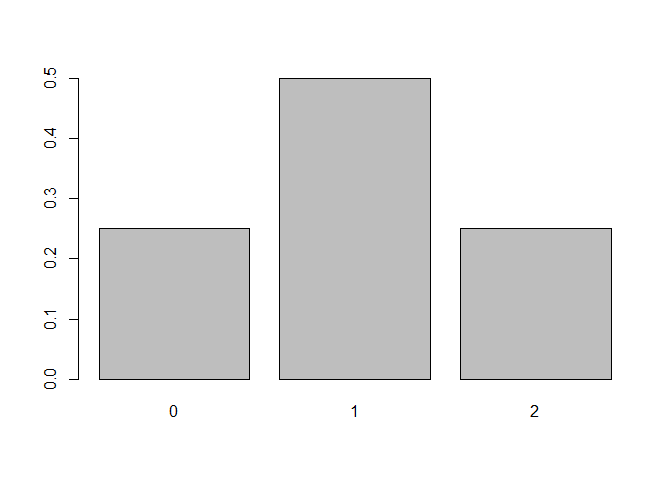
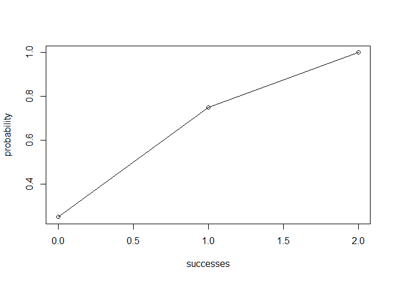

Overview
--------

`"binomial"` is a package that provides functions to cope with binomial distribution.

-   `bin_variable()` shows a list of binomial variables (of class `"binvar"`)
-   `bin_choose()` calculate the number of possible outcomes given binomial variables
-   `bin_mean()` `bin_mode()`, etc. calculate the summary statistics of given binomial experiment
-   `bin_probability()` calculate probability of a specific number of success
-   `bin_distribution()` show a dataframe of probability distribution(of class `"bindis"`)
-   `plot()` method for a `"bindis"` object to graph probability distribution
-   `bin_cumulative()` show a dataframe of cumulative probability (of class `"bincum"`)
-   `plot()` method for a `"bincum"` object to graph cumulative probability

Motivation
----------

This package has been developed to make binomial operations easier.

Usage
-----

``` r
library(binomial)
#set up binomial variables and get summary statistics
variables = bin_variable(trials = 2,prob = .5)
variables
#> "Binomial variable"
#> 
#> Parameters
#> - number of trials: 2
#> - prob of success : 0.5
summary(variables)
#> "Summary Binomial"
#> 
#> Parameters
#> - number of trials: 2
#> - prob of success : 0.5
#> 
#> Measures
#> - mean    : 1
#> - variance: 0.5
#> - mode    : 1
#> - skewness: 0
#> - kurtosis: -1
# calculate specific statistic measurement
bin_variance(trials = 2,prob = .5)
#> [1] 0.5
bin_mean(trials = 2,prob = .5)
#> [1] 1
bin_mode(trials = 2,prob = .5)
#> [1] 1
bin_skewness(trials = 2,prob = .5)
#> [1] 0
bin_kurtosis(trials = 2,prob = .5)
#> [1] -1
#calculate number of possibile outcomes
bin_choose(n = 5, k = 2)
#> [1] 10
#calculate probability of getting a specific number of success
bin_probability(1,2,.5)
#> [1] 0.5
# given trilas and probability, show probability distribution and its plot
dis = bin_distribution(2,.5)
dis
#>   success probability
#> 1       0        0.25
#> 2       1        0.50
#> 3       2        0.25
plot(dis)
```



``` r
# given trilas and probability, show cumulative probability and its plot
cum = bin_cumulative(2,.5)
cum
#>   success probability cumulative
#> 1       0        0.25       0.25
#> 2       1        0.50       0.75
#> 3       2        0.25       1.00
plot(cum)
```


