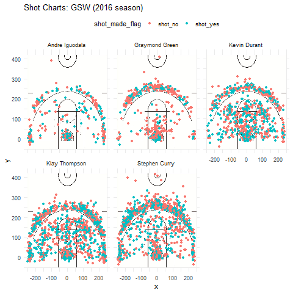

Workout 1
================
YU JI

Analyze Shooting Performance, Win the Game
==========================================

Motivation
----------

How to win a basketball game? The most obvious answer is to earn more scores. This passage analyzes the shooting performance of five players from GSW to illustrate their strengths and weaknesses, helping the team find aspects to work on accurately and decide better game strategy, improving the chance of winning.

Background
----------

In a basketball game, one of the most exciting moments is when the player jumps up and throws the ball. At that moment, all of the audience hold breath and fix their eyes on it. Of course, whether the players make the shot or not affects the final result of the game. Moreover, sometimes a single shot in the last few seconds turns out to be the game-changer. Many reasons can explian why the shooting performance of players matters significantly to a team. In order to win a game, excellent shooting skills is one of the indispensable factors. So now, by looking at the statistical data of five players of GSW, we want to analyze their shooting ability to make the training more efficient.

Data
----

Data are shooting statistics of five players, Stephen Curry, Klay Thompson, Kevin Durant, Draymond Green and Andre Iguodala, with certain manipulation. Time is from 2016 to 2017. Each line of the dataset contains the detailed information for a shot. (For more information, check folder data.)

Analysis
--------

### Team general shooting statistics

| shot\_type     |  made|  total|  perc\_made|
|:---------------|-----:|------:|-----------:|
| 2PT Field Goal |  1328|   2402|    55.28726|
| 3PT Field Goal |   763|   1932|    39.49275|

From the table, it has clearly shown that about half of the 2-point field goals are successful, and players score 40% of 3-point shots, which is easy to understand according to different level of difficulty for them. There is still room for improvement in accuracy of shooting for the whole team since the percentage of successful shooting is not that satisfactory and unbeatable. Maybe higher percentage of effectiveness can be achieved if the players practice more in shooting skills cooperate more closely and avoid interception from their rivals.

### Contribution of players

Now, to be more accurate in terms of making training schedules for the players, first I want to show you a rough idea of shots by each player in the following vivid chart which has a background picture of an NBA court, with the red points representing ineffective shots, and green ones meaning successful scores. 

Obviously, Kevin Durant, Klay Thompson and Stephen Curry have the most colored points, which indicates that they attempted the most shots. Moreover, Andre Iguodala and Draymond Green, whose main job is to defend, made relatively fewer shots. Nevertheless, making shots alone does not entail winning scores, so it is more informative to look at their contribution to effective shots of the whole team.

| name           |  effective\_shot|  team\_total|  perc\_contribution|
|:---------------|----------------:|------------:|-------------------:|
| Stephen Curry  |              584|         2091|            27.92922|
| Klay Thompson  |              575|         2091|            27.49880|
| Kevin Durant   |              495|         2091|            23.67288|
| Draymond Green |              245|         2091|            11.71688|
| Andre Iguodala |              192|         2091|             9.18221|

From the table, we can see that of the 2091 effective shots, Stephen Curry and Klay Thompson contribute more than half to the whole team, which is in line with the fact that they are the point guard and shooting guard. However, as a shooting guard (or small forward sometimes), Andre Iguodala may have more room for improvement in finding chances to make effective shots. But we need more data about the accuracy of shooting to make better judgements about their ability of shooting accurately.

### Individual shooting performance

Players with lower accuracy in making effective shots should work on that aspect and enhance their scoring ability, since it is always pitiful to make a shot against all opponents but miss it. Therefore, before making any training plan or game strategy, it is necessary to look at their individual shooting ability.

| name           |  total|  made|  perc\_made|
|:---------------|------:|-----:|-----------:|
| Kevin Durant   |    915|   495|    54.09836|
| Andre Iguodala |    371|   192|    51.75202|
| Klay Thompson  |   1220|   575|    47.13115|
| Stephen Curry  |   1250|   584|    46.72000|
| Draymond Green |    578|   245|    42.38754|

So based on the table, regardless of the shot type, all of the five players got almost half in successful shots of their individual totals, although Draymond Green has way to go in improving shooting effectiveness. In addition, despite the fact that Thompson and Curry made the most effective shots over all for the team, their accuracy of shooting seemed to be poorer than Kevin Durant.

Then I want to take a closer look at their different performance for different shot types to give them more accurate advice in training schedules.

| name           |  total|  made|  perc\_made|
|:---------------|------:|-----:|-----------:|
| Andre Iguodala |    210|   134|    63.80952|
| Kevin Durant   |    643|   390|    60.65319|
| Stephen Curry  |    563|   304|    53.99645|
| Klay Thompson  |    640|   329|    51.40625|
| Draymond Green |    346|   171|    49.42197|

To be more specific, in terms of 2-point shooting, Iguodala and Durant are far ahead of their counterparts in making scores, although Iguodala had the least 2-point shots. So if there is anything else to work with, maybe Iguodala should try to find more scoring chance under the premise that he has already fulfilled his duties for his position, or other teammates can pass the ball to him to score the 2-point if possible. While Stephen Curry and Klay Thompson are on the middle level in the team.

| name           |  total|  made|  perc\_made|
|:---------------|------:|-----:|-----------:|
| Klay Thompson  |    580|   246|    42.41379|
| Stephen Curry  |    687|   280|    40.75691|
| Kevin Durant   |    272|   105|    38.60294|
| Andre Iguodala |    161|    58|    36.02484|
| Draymond Green |    232|    74|    31.89655|

Here comes the most valuable score, 3-point goals, which is expected to have lower accuracy for all players on average, taking the degree of difficulty into account. Admirably, Thompson and Curry got the first two places both in number of shots and percentage of success, which is a good illustration that they have fulfilled their duties as point guard and shooting guard. Green has noticeable weakness in making effective scores, probably because he is a power forward whose main duty is to defend against opponents. Maybe sometimes he took a shot, not aiming to score but to pass the ball to his teammates. Otherwise, it is advisable that he work on both the skills of defense and scoring to reduce mistakes, or he is suggested to pass the ball to teammates that are more skilled if the situation permits.

Conclusion
----------

Based on the analysis above, in order to win the game, every player has to fulfill their own duties and try to score more points. Besides, each player should know exactly what the strengths and weakness are for both themselves and their teammates to better cooperate as a whole. If they analyze carefully and make the training plan and game strategy accordingly, they will improve the possibility of winning!

References
----------

Shooting data for players: <https://github.com/ucb-stat133/stat133-hws/tree/master/data>

Court image: <https://github.com/ucb-stat133/stat133-hws/tree/master/images>

Guidance and instructions: <https://github.com/ucb-stat133/stat133-hws/blob/master/2019-spring/workout01.pdf>
